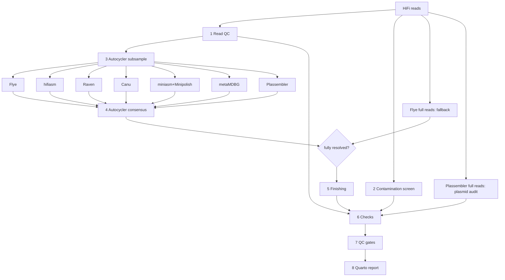

# isolate-genome-assembler: implementation plan

Status: Phase 7 implemented, 2026-09-23. All eight stages (read QC, contamination screen,
assembly, consensus, finishing, the stage 6 checks, `qc_gates.py` and the Quarto report) are
implemented and covered by stub, unit and render tests, and Phase 7 adds the full-read
assemblies, their scoring and score-based selection; the real validation runs of
Phases 1–5 and 7 are still outstanding (see each phase below). Phase 6's benchmark harness is
in place and waiting on its HPC runs. Open decisions are resolved
([Decisions](#risks-and-open-questions)). Phases are listed at the end ([Phases](#phases)).
Update this header as each phase lands, the same way `superresolution-amplicon/docs/*_plan.md`
does.

## Goal

A Nextflow (DSL2) pipeline that turns **PacBio HiFi reads from a bacterial or archaeal
isolate** into a **complete, finished, checked genome**: one circular contig per replicon,
plasmids included, oriented, annotated, and with a report showing every check the
assembly passed or failed.

It must run unattended on **SLURM with Singularity/Apptainer**, and each sample gets
**pass / warn / fail** calls a person can act on.

### Scope

- Input is **HiFi only**. There is no Illumina data, so there is no short-read polishing
  (Polypolish, Pypolca). There is no ONT-style polishing either: Medaka is not used, and
  Racon runs only inside miniasm+Minipolish.
- One isolate per sample. Mixed cultures and metagenomes are **detected and reported**, not
  assembled.
- Methylation (kinetics) analysis is out of scope for v1. Its place is noted in
  [Later](#later-not-v1).

## Design decisions

### 1. Consensus assembly: Autocycler, run as Nextflow processes

**Can Autocycler run well under Nextflow? Yes.** Autocycler (v0.7.0 at the time of writing)
has seven steps:

| Step | Command | Cost | Parallel unit |
|---|---|---|---|
| 1 | `autocycler subsample` | seconds | per sample |
| 2 | input assemblies (`autocycler helper <assembler>` or the assembler directly) | **almost all of the runtime** | per sample × subset × assembler |
| 3 | `autocycler compress` | minutes | per sample |
| 4 | `autocycler cluster` | seconds | per sample |
| 5–6 | `autocycler trim` / `resolve` for each QC-pass cluster | seconds each | per cluster |
| 7 | `autocycler combine` | seconds–minutes | per sample |

Only step 2 is worth spreading across nodes. Steps 3–7 read and write one shared
`autocycler_out/` directory and finish in minutes, so they run as **one process**. Splitting
them would mean staging that directory between tasks for no speed gain. The Nextflow shape:

```
SUBSAMPLE (1 task/sample) ─► N subsets
   └─► ASSEMBLE_<TOOL> (1 task per sample × subset × tool, fanned out by SLURM)
         └─► groupTuple(by: sample) ─► AUTOCYCLER_CONSENSUS (compress → cluster →
             trim/resolve loop → combine --reads → table)
```

**Run each assembler directly, not through `autocycler helper`.** The helper checks that
its tool is on `PATH`, so every helper call would need an image containing all the
assemblers. Direct calls let each process use that tool's own pinned BioContainer and
its own SLURM resources (Canu needs far more time than Raven). Copy the helper's
command-line choices from Autocycler's `src/helper.rs`, because those are the settings
Autocycler is tuned for:

| Assembler | Invocation (HiFi) | Output taken |
|---|---|---|
| Flye | `flye --pacbio-hifi reads --threads T --out-dir d` | `assembly.fasta` (keeps `circular=` hint from `assembly_info.txt`) |
| hifiasm | `hifiasm -t T -o d/hifiasm -l 0 -f 0 reads` | `hifiasm.bp.p_ctg.gfa` → fasta |
| Raven | `raven --threads T --disable-checkpoints --graphical-fragment-assembly out.gfa reads` | stdout fasta |
| Canu | `canu -p canu -d d -fast genomeSize=G useGrid=false maxThreads=T -pacbio-hifi reads` | `canu.contigs.fasta`: repeat/bubble contigs dropped, circular contigs trimmed by `trim=`, depths from `canu.contigs.layout.tigInfo` |
| miniasm + Minipolish | `minimap2 -k23 -Xw11 -e0 -m100 reads reads` → `miniasm -f reads` → `minipolish --minimap2-preset map-hifi --skip_initial` | polished GFA → fasta |
| metaMDBG | `metaMDBG asm --in-hifi reads --out-dir d --threads T` | `contigs.fasta.gz` |
| Plassembler | `plassembler long -d DB -l reads --pacbio_model pacbio-hifi --skip_qc` | `plassembler_plasmids.fasta`, circular contigs tagged `Autocycler_cluster_weight=2` |

**Verified against Autocycler v0.7.0's `src/helper.rs` on 2026-09-20.** Two rows were
wrong in the first draft and are corrected above: Canu needs `-d` (not `-o`), `-fast` and
`useGrid=false`, and the HiFi miniasm overlap uses `-k23 -Xw11 -e0 -m100`, not the `ava-pb`
preset, which is for noisy CLR reads. The flags change between releases, so recheck this
table whenever the pinned Autocycler version moves.

**Do the same logic without Autocycler?** It could be done in Nextflow as a downstream
module: cluster contigs by mash/skani distance, pick a representative per cluster, and
correct it by majority vote over alignments. **Not recommended.** Autocycler's
unitig-graph consensus already solves the hard parts:

- start positions that differ between assemblies on circular contigs;
- overlaps at contig ends (Canu, miniasm);
- telling contained fragments apart from real small plasmids;
- base-level majority voting.

A reimplementation would be a worse Autocycler. The Nextflow parts worth writing are the
fan-out, a **fallback**, and a **manual-curation re-entry point**:

- **Fallback.** Autocycler can fail. `cluster` refuses to run past `--max_contigs`, or
  `combine` reports `consensus_assembly_fully_resolved: false`. In that case the sample
  still gets an assembly: the **Flye assembly of the full read set**, marked
  `assembly_source=fallback_flye` and given **warn** status. This follows Ryan Wick's
  "Fast Autocycler with Flye fallback" pipeline. The unresolved Autocycler output is still
  published for inspection.
- **Manual curation.** An optional samplesheet key `autocycler_cluster_args` (e.g.
  `--manual 12,34` or `--cutoff 0.15`) is forwarded to `autocycler cluster`. An optional
  `autocycler_dir` key points at a previous run's published `autocycler_out/`, which skips
  steps 1–3 for that sample. This works like `mseq` in superresolution-amplicon: the
  expensive stage is reused so re-clustering is cheap.

### 2. MDBG: include **metaMDBG**, not rust-mdbg

A minimizer-space de Bruijn graph is a genuinely different algorithm from Flye's repeat
graph, hifiasm's string graph and Raven/miniasm's overlap-layout. Consensus benefits most
from assemblers whose errors don't overlap, so an MDBG assembler earns its place.

- **rust-mdbg** (the original) is a fast research prototype. Its contigs are fragmented,
  it doesn't try to circularise, and it is effectively unmaintained. Autocycler doesn't
  support it, and fragmented inputs mostly add QC-fail clusters.
- **metaMDBG** is the maintained successor. It has a native `--in-hifi` mode, iterative
  multi-k assembly, and Autocycler helper support. Wick lists it among the "nice to include
  for variety" assemblers.

**Risk.** metaMDBG is tuned for metagenomes. It may drop low-depth replicons or split
near-identical repeats differently. That is acceptable, because Autocycler's cluster QC
drops contigs only a minority of assemblies agree on. The per-assembler contribution
metric (Checks, section C) shows whether it helps. If it doesn't, turn it off with
`--assemblers`.

Other assemblers Autocycler supports can be enabled but are **off by default**:

- **Myloasm**: fast and also a different algorithm, so cheap to trial.
- **LJA**: a multiplex de Bruijn graph designed for HiFi, so another algorithmically
  distinct option.
- **NECAT** and **NextDenovo**: built for noisy reads (ONT, CLR), so not useful for HiFi.

The benchmark in [Phase 6](#phase-6--benchmark-and-defaults) decides whether any of these
become defaults.

### 3. Plassembler runs twice

1. **As an Autocycler input**, once per subset, with circular plasmid contigs tagged
   `Autocycler_cluster_weight=2`. This follows Wick's automated pipeline: small plasmids
   that only Plassembler finds still pass cluster QC.
2. **Once on the full read set** as a **plasmid audit**. Its `plassembler_summary.tsv`
   (plasmid lengths, copy numbers, PLSDB hits) is compared with the final assembly. A
   plasmid Plassembler found that is **missing from the consensus** gives a **warn**, and
   the contig is shown in the report so a person can decide whether to add it back.

HiFi library prep removes short fragments, so plasmids under ~10 kb are under-represented.
The report says this explicitly whenever no small plasmids are found: absence of evidence
is weaker than usual here.

### 4. Contamination screen: sylph against GTDB + human

- **Species-level read profile.** `sylph sketch -r reads` makes the read sketch.
  `sylph profile` runs it against the prebuilt **GTDB r226** database
  (`gtdb-r226-c200-dbv1.syldb`), and **sylph-tax** adds taxonomy.
- **Human.** Build a sylph database once from **CHM13 v2.0 (T2T) and GRCh38**
  (`sylph sketch -g`), in a `PREPARE_DATABASES` entry point. Human contamination is usually
  low-abundance and sylph's profile ANI threshold can miss it, so human uses
  **`sylph query`** (containment ANI, no abundance model), not `profile`. As a second,
  direct measure, map reads to CHM13 with `minimap2 -x map-hifi` and report the **fraction
  of human reads**. `--remove_human auto` (default) drops those reads before assembly **only when human is detected**: sylph query hits human, or the mapped fraction reaches `contam_max_human`. `true` always removes, `false` never does. Whether removal ran, and why, goes into the sample's metrics.
- **Unknown fraction.** Report how much of the read set sylph *cannot* place, using
  sylph's unknown-abundance estimate (check that flag exists in the pinned version). A
  large unknown fraction with one dominant species is normal for novel taxa; alongside two
  species it is not.
- **Gates** (all thresholds are params):

  | Condition | Call |
  |---|---|
  | Dominant GTDB species < `contam_min_dominant` (default 0.90 sequence abundance) | fail |
  | Any second species ≥ `contam_max_secondary` (default 0.01) | warn (≥ 0.05: fail) |
  | Human read fraction ≥ `contam_max_human` (default 0.001) | warn |
  | Samplesheet `expected_taxon` doesn't match sylph's dominant lineage at the given rank | warn |

- **Assembly-level cross-checks** (see Checks, section F): GTDB-Tk on the finished genome
  must agree with sylph's dominant species, and CheckM2 contamination must be low. A
  second-species signal in reads that never shows up in the assembly is expected:
  Autocycler drops low-depth clusters. The report shows both.

### 5. Containers and modules

- **nf-core modules wherever they exist** (`nf-core modules install`), each pinned by the
  modules repo commit. They come with versions reporting, stubs and tests. **Confirmed
  2026-09-17** against `nf-core/tools` 4.1.0: `flye`, `hifiasm`, `canu`, `minimap2/align`,
  `samtools/*`, `mosdepth`, `bcftools/*`, `seqkit/stats`, `nanoplot`, `sylph/sketch`,
  `sylph/profile`, `sylph/query`, `checkm2/predict`, `bakta/bakta`, `busco/busco`,
  `gtdbtk/classifywf`, `diamond/blastp`, `bandage/image`, `merqury/merqury`, and
  `skani/{dist,sketch}` are available. `dnaapler/all`, `meryl/*`, and `plassembler/*` are
  not available as nf-core modules and therefore stay local.
- **Local modules** (`modules/local/`) for everything else, including the confirmed missing
  `dnaapler`, `meryl`, and `plassembler` modules, each on a **pinned
  BioContainers image** (Galaxy depot `.sif` for Singularity, quay for Docker): Autocycler,
  Raven, miniasm+Minipolish, metaMDBG, HiFiAdapterFilt, Inspector, sylph query/sylph-tax,
  and the pipeline's own scripts.
- **One custom image**, `ghcr.io/timrozday-mgnify/isolate-genome-assembler-report`, holds
  Quarto, Python (pandas, pyyaml, pysam, plotly), and the `bin/` scripts' dependencies.
  It is built by `.github/workflows/build-images.yml`, as in superresolution-amplicon:
  amd64 only, `provenance: false`, `sbom: false` so Singularity can convert it, public
  package.
- **Conda** is not a supported profile. Plassembler and GTDB-Tk environments are fragile.
  Containers only, as in the reference repo.

## Repository standards (mirroring superresolution-amplicon)

| Item | Standard |
|---|---|
| Layout | `main.nf` (samplesheet parsing + validation only), `workflows/isolate_genome_assembler.nf`, `subworkflows/local/*`, `modules/{nf-core,local}/*/main.nf`, `bin/` (Python scripts), `conf/{base,modules,slurm}.config`, `assets/` (example samplesheet, report template, sentinel files), `tests/`, `dev/` (benchmarks: `.py` + `.csv` + `.md` per study), `docs/` (plans), `containers/` |
| Samplesheet | **YAML** list (or `samples:` map), parsed with snakeyaml in `main.nf`. Relative paths resolve against `projectDir`, each key is validated with a clear `error`, and optional keys are added to `meta` **only when present** so cached task hashes survive |
| Params | Every param in `nextflow.config` with an explanatory comment next to it (what it does, why the default, where the evidence is in `dev/`) |
| Resources | `process_single/low/medium/high` (+ `process_long`, `process_high_memory`) labels in `conf/base.config`. Retry on 104/125/130/137/140/143/175 with `task.attempt` scaling, `resourceLimits` from `--max_cpus/--max_memory/--max_time` |
| Publishing | `publishDir = [enabled: false]` by default. Each process opts in inside `conf/modules.config` with `saveAs` dropping `versions.yml`. All `ext.args` are **closures**, so `-c` overrides apply |
| Profiles | `docker`, `singularity`, `apptainer`, `slurm`, `test` (tiny real data), `test_stub` |
| Provenance | `pipeline_info/{trace.txt,report.html,timeline.html,dag.html}`, collated `software_versions.yml`, `params.json` |
| Tests | **nf-test** pipeline stub tests that assert `workflow.success`, the exact task count, and key published files; module stub tests; **pytest** for every `bin/` script (`tests/test_*.py`); a tiny fixture generator `tests/data/generate_fixture.py` |
| Hooks | `.pre-commit-config.yaml`: pre-commit-hooks (whitespace, EOF, yaml/json, large files ≤ 5 MB, LF), `ruff`, and a local `nextflow run main.nf -preview` hook |
| CI | `ci.yml`: `nf-test test --tag stub` + `pytest`. `build-images.yml`: the report image |
| Docs | `README.md` with Quick start, HPC (Singularity/SLURM), Databases, Samplesheet table, Parameters, Outputs, Checks and gates, Containers, Testing. `AGENTS.md` points agents at this plan |
| Commits | Imperative, one change per commit, e.g. "Add Autocycler consensus with Flye fallback" |

## Inputs

### Samplesheet (`assets/samplesheet.example.yml`)

```yaml
# id                       required. Unique sample id.
# reads                    required. HiFi FASTQ(.gz) or PacBio hifi_reads.bam; path or list (runs are concatenated).
# genome_size              optional. e.g. 5.2m. Default: estimated (see Read QC).
# expected_taxon           optional. GTDB-style lineage string, e.g. "g__Escherichia" or "s__Escherichia coli".
# reference                optional. Closest known complete genome FASTA, for skani ANI and dotplot.
# autocycler_cluster_args  optional. Extra args for `autocycler cluster` (manual curation).
# autocycler_dir           optional. A previous run's autocycler_out/<id>; skips subsample/assemble/compress.
- id: isolate01
  reads: data/isolate01.hifi_reads.fastq.gz
  expected_taxon: g__Escherichia
```

### Databases (params, all prebuilt; `-entry PREPARE_DATABASES` downloads/builds them)

| Param | Contents | Approx. size |
|---|---|---|
| `sylph_gtdb_db` + `sylph_gtdb_taxonomy` | `gtdb-r226-c200-dbv1.syldb` + sylph-tax metadata | ~15 GB RAM to profile |
| `sylph_human_db` | sylph sketch of CHM13 v2.0 + GRCh38 | small |
| `human_reference` | CHM13 v2.0 FASTA (minimap2 human fraction) | 3 GB |
| `plassembler_db` | `plassembler download` | ~few GB |
| `checkm2_db` | CheckM2 DIAMOND db | ~3 GB |
| `bakta_db` | Bakta **light** db (decided 2026-09-17; full db is ~70 GB and optional) | ~2 GB |
| `busco_db` | offline `bacteria_odb12` / `archaea_odb12` (or `--auto-lineage-prok`) | ~1 GB |
| `gtdbtk_db` | GTDB-Tk data for **r232** (GTDB-Tk 2.7+) | ~110 GB |
| `ideel_db` | DIAMOND db of UniProt Swiss-Prot (default) or UniRef90 | 0.3 / 40 GB |

Every database path is checked at start-up (`checkIfExists`). The version of each database
used goes into `software_versions.yml` and the report.

## Pipeline stages



### 1. Read QC

Each item is a process or a column in `read_qc.tsv`:

1. **Input normalisation.** Convert BAM to FASTQ with `samtools fastq` (keep `rq`; drop
   kinetics). Concatenate multiple runs. Count reads with `rq < 0.99` (below Q20), which
   shouldn't be in a `hifi_reads` file; filter them with `--min_read_qv 20`.
2. **Read statistics.** `seqkit stats -a`: count, total bases, N50, mean/min/max length, Q20/Q30
   fractions.
3. **Distributions.** `NanoPlot` (or the pipeline's own script if NanoPlot's HiFi output is
   poor): length histogram, length × quality, quality histogram.
4. **Per-read GC distribution.** Script over reads. A bimodal or wide GC distribution is an
   early contamination signal, independent of any database.
5. **Adapter screen.** `HiFiAdapterFilt` (`pbadapterfilt.sh`): count and fraction of reads with
   leftover adapter/primer hits. With `--remove_adapter_reads true` (default), those reads
   are dropped.
6. **Genome size.** Samplesheet `genome_size` if given. Otherwise `autocycler helper
   genome_size` (a Raven assembly of all reads), cross-checked against a **k-mer estimate**
   from `KMC` + `GenomeScope2 -p 1`. More than 20% disagreement between the two gives a warn.
7. **Depth.** Total bases ÷ genome size. `< 25×` fails (below Autocycler's minimum subset
   depth), `25–50×` warns.
8. **K-mer spectrum shape.** From the GenomeScope2 fit: a second peak at half depth means
   **mixed strains or heterozygosity in a supposedly clonal isolate**, which gives a warn.
   This catches same-species contamination that sylph cannot tell apart.
9. **Duplicate reads.** Fraction of exact-duplicate read IDs/sequences (demultiplexing or
   concatenation mistakes).
10. **Human-read removal**, only when stage 2 detects human (`--remove_human auto`).

### 2. Contamination screen

See [Design decision 4](#4-contamination-screen-sylph-against-gtdb--human). Outputs:
`sylph_profile.tsv`, `sylph_tax.tsv`, `human_query.tsv`, `human_fraction.tsv`,
`contamination_summary.json`.

### 3. Subsample and assemble

- `autocycler subsample --count ${params.subsample_count} --min_read_depth ${params.subsample_min_depth} --genome_size G`.
  Defaults are 4 and 25. With 7 assemblers that gives 28 input assemblies, the scale
  Autocycler's clustering thresholds assume.
- `--assemblers flye,hifiasm,raven,canu,miniasm,metamdbg,plassembler` (comma list; also
  accepts `myloasm`, `lja`).
- One task per sample × subset × assembler, with **`errorStrategy 'ignore'` after retries on
  assembler processes only**. One assembler crashing on one subset is expected and must not
  sink the sample. The failure is recorded (trace + an `assembly_attempts.tsv` built from
  which input FASTAs arrived) and reported.
- Contig headers are normalised to `<assembler>_<subset>_<n> [circular=true]` before
  consensus, so per-assembler contribution can be traced (section C).
- **Fallback assembly:** `FLYE_FULL` on the full read set runs for every sample. It is
  cheap, and running it unconditionally keeps the DAG static and resume-safe.

### 4. Consensus

`AUTOCYCLER_CONSENSUS` (one process): `compress -i assemblies -a autocycler_out` →
`cluster` (+ `autocycler_cluster_args`) → `trim` + `resolve` for each `qc_pass` cluster →
`combine --reads` (reads give real depths in the headers) → `table`.

The process also runs `autocycler dotplot` on each cluster for the report. `SELECT_ASSEMBLY`
(script, run in `SCORING` because it needs the scores) picks between the consensus and the
scored full-read assemblies as `--assembly_selection` says, and writes `assembly_source`
into the sample's metrics.

### 5. Finishing

1. **Contig check.** Drop nothing silently. Linear contigs, contigs shorter than
   `min_contig_len` (default 1 kb) and contigs below 0.1× chromosome depth are kept and
   **flagged**. `--drop_flagged_contigs` removes them from the final FASTA; the removed
   contigs go to `<id>.removed_contigs.fasta`.
2. **End-overlap check.** Confirm no circular contig still has duplicated sequence at its
   ends: self-align the first/last 10 kb with minimap2. Autocycler's `trim` should already
   have removed it; the fallback Flye path is the one that needs checking.
3. **Rotation.** `dnaapler all --autocomplete mystery`: chromosome starts at *dnaA*,
   plasmids at *repA*, phages at *terL*. Unrotatable contigs are reported.
4. **Replicon classification.**
   - Chromosome: longest contig, or several if > `chromosome_min_len` (default 1 Mb).
   - Plasmid: circular, below that threshold.
   - Plassembler/PLSDB hits and the dnaapler gene hit are added as supporting evidence.
   - Optional `--run_genomad` (off) for a plasmid/virus call.
5. **Renaming.** `<id>_chromosome`, `<id>_plasmid_1..n` (by length). Headers keep
   `length= depth= circular=`.
6. **No polishing by default.** HiFi consensus accuracy is already above Q50. Autocycler's
   voting removes random errors. Systematic HiFi errors (long homopolymers) are
   **measured** in stage 6 and not blindly "fixed". A later option, if the checks show a
   need: a conservative HiFi-read pileup correction applied only at sites where ≥ 80% of
   reads disagree with the assembly.
7. **Final assembly QC gate** (see stage 7) runs before annotation-heavy checks, so failing
   samples are reported but annotation isn't wasted on them (`--annotate_failed false`).

### 6. Checks

Each check writes a small TSV/JSON under `checks/<id>/` that the metrics collator reads.

**A. Structure and completeness of the graph**
- Autocycler metrics: `consensus_assembly_fully_resolved`, `pass_cluster_count`,
  `fail_cluster_count`, `overall_clustering_score`, per-cluster `trimmed_cluster_size`
  and `trimmed_cluster_mad`.
- Circular flag per contig. The target is every replicon circular.
- `Bandage image` PNG of `consensus_assembly.gfa` (and of the Flye graph when the fallback
  is used). The graph should have one component per sequence and no tangles.

**B. Read support** (`minimap2 -ax map-hifi` → sorted, indexed BAM). Circular contigs are
mapped against a copy with 20 kb of the start appended to the end, then depths are folded
back, so reads spanning the origin aren't counted as clipped.
- **Mapping rate.** The fraction of reads (and bases) that don't map is a key number. It
  points to contamination, or to a replicon missing from the assembly. Unmapped reads are
  re-profiled with sylph and assembled with Flye as a quick check, and any circular contig
  from that is reported as a **"possible missing replicon"**.
- **Coverage uniformity.** `mosdepth` in 1 kb and 10 kb windows. Windows below 0.5× or above
  2× the contig median are flagged, merged into regions, and the regions are listed.
  - A **drop** suggests a misassembly or an under-represented region.
  - A **~2× spike** suggests a collapsed repeat, e.g. rRNA operons or IS elements.
- **Clipping pile-ups.** Script over the BAM: positions where ≥ `clip_min_reads` (default 5)
  reads *and* ≥ 20% of depth are soft/hard-clipped by ≥ 500 bp. These are candidate
  misjoins or structural errors.
- **Structural/small errors.** `Inspector` (reads vs contigs) gives its structural error
  list, small-scale error count and QV.

**C. Consensus consistency**
- Per assembler: the fraction of subsets whose contigs reached each QC-pass cluster, parsed
  from Autocycler's clustering output (check the file format for the pinned version).
- Per cluster: which assemblers disagreed or were excluded by `trim`.
- `assembly_attempts.tsv`: which sample × subset × assembler tasks failed.
- An assembler that routinely fails to contribute is a candidate for removal from defaults.

**D. Per-base accuracy**
- **Variant scan.** Run `bcftools mpileup | bcftools call --ploidy 1` on the BAM (min
  depth 10) and report variant counts binned by allele frequency:
  - AF ≥ 0.5 means a **likely assembly error**. Target: 0.
  - AF 0.2–0.5 means a **mixed strain or collapsed repeat**. List them.
  - Indels in homopolymers ≥ 8 bp are tallied separately. This is the known systematic HiFi
    failure mode.
- **Merqury QV.** Build a meryl db from the reads (k chosen with `best_k.sh` for the genome
  size, ≈ 17–19) and run Merqury. Report QV and k-mer completeness, plus the spectra-cn
  plot. Its limitation, stated in the report: the same reads built the assembly, so this
  measures self-consistency, not independent truth.

**E. Gene-level integrity (frameshift proxy)**
- **Bakta** annotation (GFF3, GenBank, FAA, TSV) gives pseudogene count, CDS count, coding
  density, rRNA operon count and tRNA count.
- **IDEEL-style test.** Run `diamond blastp` of the Bakta proteins against `ideel_db` (top
  hit) and compute query/subject length ratios. Report the histogram and the **fraction of
  proteins with ratio < 0.9**. A high fraction relative to closely related genomes points to
  indel errors.
- **rRNA collapse check.** Compare depth over each 16S/23S locus with the chromosome median.
  About n× depth over a single annotated operon means the operons collapsed.

**F. Completeness, contamination and identity**
- `CheckM2 predict`: completeness, contamination.
- `BUSCO` (prokaryote auto-lineage or offline lineage): C/S/D/F/M. High **duplicated** BUSCOs
  are a contamination or duplication signal.
- `GTDB-Tk classify_wf`: classification, closest reference, ANI, `classification_method`,
  warnings.
- `skani dist` against the samplesheet `reference`, when given: ANI and aligned fraction.
  A minimap2 dotplot against the reference goes in the report.
- **Agreement:** GTDB-Tk species == sylph dominant species == `expected_taxon`.

**G. Replicon depth and plasmid copy number**
- Depth ratio for each contig: contig median depth ÷ chromosome median depth (mosdepth).
  - Below 0.5 on a plasmid is a warn (possible contaminant or sub-population).
  - Copy number > 50 is noted, not warned.
- Plasmid audit (Plassembler on full reads, via mash/skani containment against the final
  contigs):
  - listed plasmids are marked **recovered** or **missing**;
  - any missing plasmid is a warn;
  - the report states that HiFi size selection under-represents plasmids under ~10 kb.

### 7. QC gates

`bin/qc_gates.py` reads every per-sample metric and writes `<id>.qc.json`: one entry per
check with `{value, threshold, status, message}`, plus an overall status = worst entry.

Thresholds live in `assets/qc_thresholds.yml` and can be overridden with
`--qc_thresholds`, so the gate logic is data, not code. Defaults:

| Check | warn | fail |
|---|---|---|
| Read depth | < 50× | < 25× |
| Dominant species (sylph) | — | < 0.90 |
| Second species (sylph) | ≥ 0.01 | ≥ 0.05 |
| Human read fraction | ≥ 0.001 | — |
| Taxon disagreement (sylph / GTDB-Tk / expected) | any | — |
| Consensus | fallback used / not fully resolved | no assembly |
| Chromosome circular | — | no |
| Plasmid missing vs audit | any | — |
| Unmapped read fraction | ≥ 0.02 | ≥ 0.10 |
| Low/high coverage regions | any | — |
| Clipping pile-ups / Inspector structural errors | ≥ 1 | ≥ 5 |
| Variants AF ≥ 0.5 | ≥ 1 | ≥ 10 |
| Merqury QV | < 50 | < 40 |
| IDEEL fraction < 0.9 | ≥ 0.10 | ≥ 0.20 |
| CheckM2 completeness | < 98 | < 90 |
| CheckM2 contamination | ≥ 1 | ≥ 5 |
| BUSCO duplicated | ≥ 2% | ≥ 5% |

These starting values are guesses. The [Phase 6](#phase-6--benchmark-and-defaults)
benchmark calibrates them, and `dev/qc_threshold_calibration.md` records why each one was
chosen.

### 8. Quarto report

**Design:** all computation happens upstream. `COLLECT_METRICS` (`bin/collect_metrics.py`)
writes one tidy **`run_summary/`** bundle for the whole run:

- `samples.tsv`
- `qc_gates.tsv` (long format)
- `read_qc.tsv`
- `contamination.tsv`
- `assemblies.tsv` (per contig)
- `autocycler.tsv`
- `assembler_contribution.tsv`
- `coverage_regions.tsv`
- `variants.tsv`
- `ideel.tsv`
- `checkm2.tsv`, `busco.tsv`, `gtdbtk.tsv`
- `plasmid_audit.tsv`
- `software_versions.yml`, `params.json`
- image paths (Bandage, dotplots, Merqury spectra)

The `.qmd` only reads and plots, so it renders the same way from **fixture data in tests**
as from a real run.

- Template: `assets/report/isolate_assembly_report.qmd` (+ `_quarto.yml`, `report.css`).
- Process `QUARTO_REPORT`: `quarto render isolate_assembly_report.qmd -P summary_dir:run_summary --to html`
  with `embed-resources: true`, so the output is a single self-contained HTML file safe to
  email or put on a share.
- One extra `-P sample:<id>` render per sample, `<id>.report.html` (`--per_sample_reports`, default `true`).
- Load the `quarto` skill when implementing.

**Report outline:**

1. **Run overview.** Pipeline version and commit, Nextflow version, run date, profile,
   databases and versions, parameters (collapsible).
2. **Sample status board.** One row per sample: overall status badge, depth, species,
   replicons (chr + n plasmids, all circular?), total length, QV, CheckM2
   completeness/contamination, assembly source. Colour by status; links to the sample
   sections.
3. **QC gate matrix.** Heatmap, samples × checks, cell = pass/warn/fail with the value on
   hover. Anything warn/fail is listed with its message.
4. **Per sample** (tabset: Reads · Contamination · Assembly · Accuracy · Genes · Taxonomy ·
   Plasmids):
   - **Reads:** stats table, length and quality histograms, GC histogram, adapter fraction,
     genome size estimates (Raven vs GenomeScope2), k-mer spectrum.
   - **Contamination:** sylph species table (abundance, ANI), human query + fraction,
     unknown fraction, taxon agreement badge.
   - **Assembly:** contig table (name, length, circular, depth, copy number, rotation gene,
     classification), Bandage image, Autocycler metrics, assembler contribution heatmap
     (assembler × cluster), failed assembly tasks, fallback note if used, dotplot vs
     reference.
   - **Accuracy:** coverage track per contig (10 kb windows, flagged regions shaded),
     clipping pile-ups and Inspector errors table, variants by AF bin (with homopolymer
     split), Merqury QV and spectra-cn.
   - **Genes:** Bakta summary (CDS, pseudogenes, rRNA operons, tRNA, coding density), IDEEL
     ratio histogram with the < 0.9 fraction, rRNA-locus depth.
   - **Taxonomy:** GTDB-Tk classification + ANI, skani vs reference, CheckM2, BUSCO bar.
   - **Plasmids:** audit table (recovered / missing), HiFi small-plasmid caveat.
5. **Methods.** Generated text naming each tool + version + key parameters, ready to paste
   into a manuscript, with citations.
6. **Software versions.**

## Outputs

```
results/
├── reads/<id>/            read_qc.tsv, seqkit, nanoplot/, gc_hist.tsv, adapters/, genomescope/
├── contamination/<id>/    sylph_profile.tsv, sylph_tax.tsv, human_query.tsv, human_fraction.tsv
├── assemblies/<id>/
│   ├── inputs/            <assembler>_<subset>.fasta (+ .gfa, .log)   [--publish_input_assemblies]
│   ├── autocycler_out/    full directory (re-entry point for manual curation)
│   ├── full/              <assembler>_full.fasta, one per --full_read_assemblers
│   ├── scoring/           full_assemblies.tsv, per-candidate circularity + trimmed FASTA
│   ├── plassembler_full/  plasmid audit
│   └── final/             <id>.fasta, <id>.gfa, <id>.contigs.tsv, <id>.removed_contigs.fasta
├── annotation/<id>/       bakta/
├── checks/<id>/           mapping/ (bam+bai), mosdepth/, clipping.tsv, inspector/, variants/,
│                          merqury/, ideel/, checkm2/, busco/, gtdbtk/, skani/, bandage/, plasmid_audit.tsv
├── qc/<id>.qc.json
├── report/                isolate_assembly_report.html, samples/<id>.report.html, run_summary/
└── pipeline_info/         trace.txt, report.html, timeline.html, dag.html, software_versions.yml, params.json
```

## SLURM

- `conf/slurm.config`, used as `-profile slurm,singularity`:
  - `executor = 'slurm'`, `queueSize = params.slurm_queue_size` (default 50),
    `submitRateLimit = '10/1min'`, `pollInterval = '30 sec'`;
  - `clusterOptions = { params.slurm_cluster_options }` (account/partition/qos);
  - `singularity.cacheDir` from `NXF_SINGULARITY_CACHEDIR`.
- Per-assembler resources in `conf/base.config` by `withName`. Canu and GTDB-Tk get
  `process_long` / `process_high_memory`. Raven, miniasm and metaMDBG get `process_medium`.
  Values are refined from the Phase 6 trace.
- **`scratch = true`** on assembler processes, so the many small intermediate files hit node
  local disk and not the shared filesystem.
- README HPC section:
  - pre-pull images (`nextflow inspect -profile singularity ... -concretize` to list them);
  - run the head job inside `sbatch --time=7-00:00:00 --mem=8G` or `tmux`;
  - always use `-resume`;
  - run `PREPARE_DATABASES` once per site into a shared location.

## Testing

- **Stub pipeline tests** (`tests/default.nf.test`, tag `stub`):
  1. default run, asserting the task count and the key final files;
  2. `--assemblers flye,raven`, asserting that no other assembler tasks run;
  3. a sample with `autocycler_dir`, asserting that no subsample/assembly tasks run;
  4. a forced fallback (stub `consensus_assembly.yaml` with `fully_resolved: false`),
     asserting `assembly_source=fallback_flye`;
  5. a failed assembler task (a stub that exits 1 for one subset), asserting the sample
     still completes and `assembly_attempts.tsv` records it.
- **pytest** for each `bin/` script: `collect_metrics.py`, `qc_gates.py` (every threshold edge),
  `clipping_pileups.py`, `coverage_regions.py`, `ideel_ratios.py`, `plasmid_audit.py`,
  `select_assembly.py`, `classify_replicons.py`, `normalise_headers.py`.
- **Report render test.** Render the `.qmd` against `tests/data/run_summary/` (fixture
  bundle with one pass, one warn, one fail sample) in the report image, and assert the HTML
  exists and names all three samples.
- **Real mini test** (`-profile test`, not in CI; run before releases). This is a small
  simulated HiFi read set from a ~1 Mb genome with two plasmids (one < 5 kb). It runs every
  stage with tiny databases, where the database format allows.

## Phases

### Phase 0: repository skeleton
- Repo files: `.gitignore`, `.pre-commit-config.yaml`, `nf-test.config`, `AGENTS.md`,
  `README.md` stub.
- Config: `nextflow.config` (manifest `nextflowVersion >= 25.0`, profiles,
  pipeline_info), `conf/base.config`, `conf/modules.config`, `conf/slurm.config`.
- `main.nf` samplesheet parsing + validation, with `assets/samplesheet.example.yml`.
- Run `nf-core modules list remote` and record which of the tools above exist as nf-core
  modules. Update the Containers section of this plan.
- CI: `ci.yml`.
- **Done when:** `nextflow run main.nf -preview` and the empty stub test pass in CI.

### Phase 1: read QC + contamination
- Stages 1–2, database preparation for sylph GTDB/human and CHM13.
- **Done when:** the stub test passes, and a real run on one isolate plus one deliberately
  mixed read set (two isolates concatenated 95:5) passes and fails the gates as expected.
- **Landed 2026-09-20.** Stub tests and `pytest` pass. Two deviations from the text above:
  - **`--prepare_databases`, not `-entry PREPARE_DATABASES`.** Nextflow's strict syntax
    (25.10+) dropped `-entry`, so the database build is selected with a param instead.
  - **Stage 1–2 processes emit measurements only.** `read_qc.tsv` and
    `contamination_summary.json` carry no pass/warn/fail, because the thresholds and
    `qc_gates.py` belong to [Phase 4](#phase-4-checks--gates). The one threshold Phase 1
    must act on is `contam_max_human`, which drives `--remove_human auto`.
  - **Still outstanding:** the real one-isolate and 95:5 mixed read-set runs. They need the
    ~15 GB GTDB database and the Phase 4 gates, so they are run together with Phase 4.

### Phase 2: assembly + consensus
- Subsample, 7 assembler processes (flags checked against Autocycler's `helper.rs`),
  header normalisation, `AUTOCYCLER_CONSENSUS`, `FLYE_FULL`, `SELECT_ASSEMBLY`, re-entry
  via `autocycler_dir`, failure tolerance.
- **Done when:** stub tests 1–5 pass, and the real mini test gives a fully resolved assembly.
- **Landed 2026-09-20.** `pytest` passes. Notes and deviations:
  - **Header normalisation is one process, not seven.** `NORMALISE_HEADERS` runs
    `bin/normalise_headers.py`, which holds every assembler's rules ported from
    `helper.rs`, so the assembler containers stay minimal and the rules have one pytest
    rather than seven copies of the same awk.
  - **`autocycler helper` is not used**, as planned, so the miniasm arm is three processes
    (`MINIASM_OVERLAP`, `MINIASM`, `MINIPOLISH`): no BioContainer carries both miniasm and
    minimap2.
  - **`plassembler_db` is now a required database param**, built by `--prepare_databases`.
  - **Assembler failure tolerance is a `withLabel: 'assembler'` rule** in
    `conf/base.config`: retry the retryable exit codes, then `ignore`. The same label gives
    those processes `scratch = true`.
  - **Two test-only params**, `stub_fully_resolved` and `stub_fail_assemblies`, exist so
    stub tests 4 and 5 can force the fallback and a failed input assembly.
  - **`scratch = true` lives in `conf/slurm.config`, not `conf/base.config`.** It is an
    HPC filesystem concern, and it breaks a local containerised run: `/tmp` inside the
    images is not writable by the mapped uid, so every assembler task fails on
    `.command.trace`.
  - **`trace.fields` now includes `name`.** The custom field list had replaced the
    default, and nf-test's trace parser needs that column to identify a task.
  - **Still outstanding:** the real mini test. It needs the simulated read set from
    [Phase 6](#phase-6-benchmark-and-defaults).

### Phase 3: finishing + plasmid audit
- Stage 5, Plassembler full-read audit, replicon classification.
- **Done when:** the mini test's small plasmid is recovered and rotated, or the audit flags
  it as missing.
- **Landed 2026-09-21.** Stub tests and `pytest` pass. Notes and deviations:
  - **`--run_genomad` is not implemented.** It is optional and off in the text above, so
    building it now would mean a module and a database nothing uses. The classifier's
    `replicon_type` column is where its call would land when Phase 6 says it earns its
    place.
  - **Plassembler evidence reaches the audit, not the classifier.** Classification uses
    length, circularity, depth and the dnaapler gene hit, because the skani comparison
    needs the finished contigs that classification itself produces. The recovered/missing
    verdict lives in `plasmid_audit.tsv`, which is where the report reads it from anyway.
  - **The end-overlap check runs before rotation.** Rotating a contig moves a duplicated
    end into the middle of the sequence, where the check can no longer see it.
  - **No `final/<id>.gfa`.** The consensus graph stops matching the sequences once contigs
    are rotated and renamed; the untouched graph is already published under
    `autocycler_out/`.
  - **Depth for the low-depth flag comes from the contig headers**, which
    `autocycler combine --reads` fills in, not from mosdepth: that is stage 6's tool and
    belongs to [Phase 4](#phase-4-checks--gates).
  - **Still outstanding:** the real mini test, which needs the Phase 6 read set.

### Phase 4: checks + gates
- Stage 6 A–G, `qc_gates.py`, `assets/qc_thresholds.yml`.
- **Done when:** every check has a pytest, and the mixed read set, a deliberately broken
  assembly (an inserted 1 kb inversion + 5 homopolymer indels) and a clean assembly produce
  the expected statuses.
- **Landed 2026-09-21.** Stub tests and `pytest` pass. Notes and deviations:
  - **Circular contigs are mapped as they are**, not against a copy with 20 kb of the start
    appended. A read spanning the origin is split there into a primary and a supplementary
    alignment; mosdepth counts both, and `clipping_pileups.py` ignores clips within 1 kb
    of a contig end, so nothing needs folding back.
  - **No `bcftools call`.** `VARIANT_PILEUP` keeps mpileup's allele depths and
    `variant_scan.py` computes the allele frequency from them. A haploid caller reports
    only the majority allele, which would hide the AF 0.2–0.5 sites this check exists for.
    The nf-core `bcftools/mpileup` module pipes into `call`, so the process is local.
  - **Unmapped reads are assembled with Flye but not re-profiled with sylph.** Stage 2
    already profiled every read, so a contaminant is already in `contamination_summary.json`;
    a second GTDB profile would cost another ~15 GB of RAM per sample to say it again.
    Flye is skipped when every read mapped.
  - **`--annotate_failed` is not implemented;** annotation runs on every sample. CheckM2
    contamination and the GTDB-Tk call are what explain most failing samples, so skipping
    them would save compute at the cost of the diagnosis. Revisit if Phase 6 shows the
    cost matters.
  - **Bandage draws the consensus graph only,** fallback or not. An unresolved consensus
    graph is what explains a fallback, and the Flye graph is published under `full/`.
  - **The minimap2 dotplot against the reference moves to Phase 5**, where the report
    draws it; skani against the reference runs here.
  - **Thresholds reach `qc_gates.py` as JSON.** The workflow reads the YAML with snakeyaml
    at start-up, so a malformed file fails before any task runs, and the gate process
    needs nothing beyond the standard library. Every check is numeric with a direction,
    so the categorical ones are counts (`consensus_unresolved`, `chromosome_not_circular`,
    `taxon_disagreement`). A check that did not run is `not_measured` and never changes
    the overall status. When sylph places no species at all (an isolate GTDB does not
    hold), the two species-abundance gates are `not_measured` rather than failing.
  - **Checks added to the gate table:** genome-size disagreement (stage 1's 20% warn),
    possible missing replicons from the unmapped reads, and the lowest plasmid depth ratio
    (check G's 0.5 warn). Clipping pile-ups and Inspector structural errors are gated
    separately, with the table's shared thresholds.
  - **Inspector runs with `--min_contig_length 1000 --min_contig_length_assemblyerror 1000`.**
    Its defaults skip contigs under 10 kb, and structural calls under 1 Mb, which would
    leave every plasmid unchecked.
  - **meryl is now an nf-core module** (`meryl/count`), so it is used rather than a local one.
    Merqury's k comes from the genome size with `best_k.sh`'s formula.
  - **Five new required databases** (`checkm2_db`, `bakta_db`, `busco_db`, `gtdbtk_db`,
    `ideel_db`), built by `--prepare_databases`.
  - **Still outstanding:** the mixed read set, the deliberately broken assembly and the
    clean assembly. They need the real databases and the Phase 6 read set, and are run
    together with Phase 1's validation runs.

### Phase 5: report
- `collect_metrics.py`, the `.qmd` template, the report image + `build-images.yml`, the
  fixture `run_summary/`, the render test.
- **Done when:** the report renders from fixtures in CI and from a real run.
- **Landed 2026-09-21.** Stub tests, `pytest` and the render test pass. Notes and deviations:
  - **`collect_metrics.py` reads a manifest of `sample, kind, file`,** built by the workflow
    from the same `[meta, kind, file]` channel `QC_GATES` groups, plus a `report` channel
    from `CHECKS`. Most kinds are TSVs concatenated as they are; only non-TSV inputs
    (the qc and contamination JSON, Inspector, Bakta, Merqury, mosdepth, PAF) have a parser.
    So bundle names follow the kinds: `contigs.tsv` rather than `assemblies.tsv`, plus
    `contig_depth`, `mapping`, `clipping`, `inspector`, `variant_sites`, `merqury_completeness`,
    `ideel_ratios`, `rrna_depth`, `bakta`, `coverage`, `dotplot`, `reference_skani`,
    `assembly_attempts`, `contamination_species` and `images.tsv` (images are copied into
    `images/`).
  - **`run_info.json` replaces `params.json`:** pipeline version, commit, Nextflow version,
    run name, start, profile and every param, in one file.
  - **Software versions are `software_versions.tsv`**, collated from the `versions` topic
    into `pipeline_info/` and the bundle. `COLLECT_METRICS` and `QUARTO_REPORT` do not emit
    to the topic: they wait for it to close, so writing to it would deadlock.
  - **The minimap2 dotplot is here, as planned:** `MINIMAP2_REFERENCE` (`-x asm5`, PAF) runs
    for samples with a `reference`, and the report draws the blocks with plotly.
  - **Fixed 2026-09-24, from the 20hm run's outputs:** three things were produced and then
    lost. `autocycler table -a` writes its row without a header, so `collect_metrics.py`
    read the row as one and `autocycler.tsv` came out empty for every sample; the module now
    writes the header first. Bakta renamed every contig to `contig_1..N`, so `rrna_depth`
    joined its GFF to mosdepth's windows and matched nothing -- `--keep-contig-headers`
    fixes it. The cluster dotplots were drawn but never emitted past
    `AUTOCYCLER_CONSENSUS`, and a sample's second image of a kind used to overwrite its
    first (GenomeScope2's transformed plot over its linear one), so repeated images are now
    numbered.
  - **Coverage tracks use the 1 kb mosdepth windows averaged to 10 kb** in the report, so
    stage 6 runs mosdepth once.
  - **Read length and quality histograms are not redrawn.** The report points at the
    NanoPlot report; `read_qc.tsv` carries the summary numbers.
  - **plotly.js is inlined once per report** (~4.5 MB), so each HTML file works offline;
    a report is ~6 MB.
  - **Per-sample reports render to the default name and are renamed:** Quarto's `--output`
    looks for the embedded libraries under the new name and fails.
  - **The report re-renders on every `-resume`,** since `run_info.json` carries the run's
    start time. It takes seconds, and the report should describe the latest run.
  - **CI builds the report image** before the stub tests (so `QUARTO_REPORT`'s stub finds it
    locally and an image change is tested before it is published) and runs the render test
    inside it. `build-images.yml` pushes it from `main`, amd64 only.
  - **Still outstanding:** rendering from a real run, together with Phase 1–4's validation
    runs.

### Phase 6: benchmark and defaults
Results go in `dev/assembler_benchmark.{py,csv,md}`.

- **Data:** 5–10 public complete genomes with known plasmids, spanning GC 30–70% and repeat
  content. HiFi reads simulated with **PBSIM3** (CCS mode) at 30×, 60× and 120×, plus
  public real HiFi isolate runs with published complete genomes (accessions chosen in this
  phase).
- **Arms:**
  - all 7 assemblers;
  - without metaMDBG;
  - without Canu;
  - the fast set (Flye, hifiasm, Raven, miniasm);
  - plus Myloasm and plus LJA;
  - `subsample_count` 4 vs 6.
- **Metrics:**
  - vs truth: edit distance per replicon (`dnadiff`/`edlib`), replicons recovered, small
    plasmids recovered, circularity;
  - consensus: fully-resolved rate;
  - cost: CPU-hours and wall time from the trace.
- **Outputs:** default `--assemblers`, `subsample_count`, per-process resources, and
  calibrated `qc_thresholds.yml`.
- **Done when:** defaults and thresholds are backed by the recorded results.
- **Harness landed 2026-09-21; the runs are outstanding.** `pytest` and stub runs of both
  benchmark modes pass, and the simulation was checked for real on *M. genitalium*
  (1,535 reads at rq ≈ 0.998, 28.8× of 30× asked for; Flye's assembly scores edit
  distance 1). Notes and deviations:
  - **Myloasm and LJA were accepted by `--assemblers` but never run.** They are now
    `MYLOASM` and `LJA` processes (flags from `helper.rs`), and `normalise_headers.py`
    reads Myloasm's `circular-yes` / `depth-` tags. Both stay off by default.
  - **The arms share one set of input assemblies.** The pipeline runs once per sample
    with all 9 assemblers × 6 subsets and `--publish_input_assemblies`; `dev/benchmark.nf
    --mode consensus` then reruns only `AUTOCYCLER_CONSENSUS` (the pipeline's own module)
    on each arm's subset of them. Seven full pipeline runs per sample would cost seven
    times the assembly, checks and GTDB-Tk for the same answer. Subsets 01–04 of a
    6-subset run stand in for `subsample_count 4`: Autocycler sizes a subset from the
    total depth alone, so only the overlap between subsets differs.
  - **Arms live in `dev/benchmark_arms.tsv`** and genomes in `dev/benchmark_genomes.tsv`,
    read by both the workflow and the scorer. The "fast set" is exactly Flye, hifiasm,
    Raven and miniasm, without Plassembler, as written above.
  - **Genomes:** eight simulated (GC 30–68%; *C. jejuni*, *S. aureus* USA300,
    *E. faecium* Aus0004, *E. coli* Sakai, *K. pneumoniae* HS11286, *H. volcanii* DS2
    (archaeon), *M. tuberculosis* H37Rv, *B. pseudomallei* K96243 (two chromosomes));
    nine plasmids under 10 kb between them, the smallest 1.3 kb. Four real HiFi runs
    whose published genome was finished with Illumina: *E. coli* ERR14041842,
    *S. aureus* SRR26799572, *K. pneumoniae* SRR32177054 (Revio) and *P. aeruginosa*
    SRR32076116. Their truth genomes were built partly from the same reads, so edit
    distances there compare arms rather than measure absolute accuracy.
  - **Simulation:** PBSIM3 `qshmm` (RSII model), 10 passes, 11 ± 3 kb inserts, then
    `ccs`. Each replicon is simulated separately from two copies end to end at half the
    depth, so reads cross the origin, with `--length-max` at the replicon length. Copy
    number is not modelled; every replicon gets the sample depth, so small-plasmid loss
    in library prep shows only in the real runs.
  - **Scoring** (`dev/assembler_benchmark.py`, `uv run` installs mappy, edlib and pyyaml):
    the delivered assembly is the arm's consensus when fully resolved, else the Flye
    fallback. Each truth replicon takes its best-aligned contig, oriented and rotated to
    the truth's start; recovered means edlib's global edit distance is within 1% of its
    length. Cost is the arm's assembler tasks from the pipeline trace plus its consensus
    task; wall time is the slowest assembler chain plus the consensus.
  - **Threshold calibration** uses the same run: the report puts each sample's gate calls
    beside how its final assembly scored against truth, and the per-process peaks from
    the trace set the resources.
  - **To run** (from a directory outside the repo):
    1. `nextflow run <repo>/dev/benchmark.nf -profile slurm,singularity`
    2. `nextflow run <repo>/main.nf --input benchmark/samples.yml --outdir results
       -profile slurm,singularity -params-file <databases>.yml --publish_outputs
       --publish_input_assemblies --subsample_count 6
       --assemblers flye,hifiasm,raven,canu,miniasm,metamdbg,plassembler,myloasm,lja`
    3. `nextflow run <repo>/dev/benchmark.nf --mode consensus --results results
       -profile slurm,singularity`
    4. `uv run <repo>/dev/assembler_benchmark.py --benchmark benchmark --results results`
       writes `dev/assembler_benchmark.{csv,md}`.

### Phase 7: full-read assemblies and assembly scoring
- Run every enabled assembler on the full read set, score each assembly reference-free,
  and fall back to the best one rather than always to Flye. Report and benchmark the
  comparison.
- Full detail, including the scoring rule and the three delivery steps:
  [full_read_assemblies_plan.md](full_read_assemblies_plan.md).
- **Done when:** the stub tests pass, `full_assemblies.tsv` renders in the report, and a
  Phase 6 benchmark arm shows whether the consensus beats the best single assembler.
- **Landed 2026-09-23 (all four steps).** `CONTIG_ENDS` no longer overlaps its own two windows;
  every assembler bar Plassembler assembles the full read set; and `SCORING` trims each
  candidate with `CIRCULARISE`, measures it from checks that already exist and ranks the
  lot into `full_assemblies.tsv`, which the report renders. `MERYL_COUNT` moved to
  `SCORING` so the k-mer database is counted once and shared with `CHECKS`.
  `SELECT_ASSEMBLY` moved into `SCORING`, because selection now needs the scores, and
  `--assembly_selection` (default `always_score`) decides between the consensus and the
  best-scoring full-read assembly; a fallback is labelled `fallback_<assembler>`. The
  `consensus_unresolved` gate now reads Autocycler's own verdict rather than inferring it
  from the source, since `always_score` can pass over a consensus that resolved.
  **Still outstanding:** the real evidence, which is the Phase 6 benchmark run --
  `assembler_benchmark.py` now scores every full-read assembly against truth and tabulates
  consensus vs best single assembler.

### Phase 8: release
- README complete (Parameters, Outputs, Checks and gates, HPC, Databases).
- Tag `v0.1.0`, image tag pinned in `nextflow.config`.

## Later (not v1)

- **Methylation motifs** from HiFi kinetics: keep `fi/ri/fp/rp` tags from the BAM, run
  `jasmine`/`ipdSummary` → MicrobeMod. This is useful for restriction-modification systems
  and for phasing plasmids by methylation.
- Batch-level comparison across isolates of the same species (skani matrix, shared plasmids).
- AMR/virulence (AMRFinderPlus is available through Bakta) and MOB-suite plasmid typing.
- ENA submission bundle (chromosome/plasmid AGP + manifest).

## Risks and open questions

| Risk | Mitigation |
|---|---|
| Autocycler flags/output layout change between versions | Pin the version; module stubs mirror the real layout; checked in Phase 2 |
| Plassembler/GTDB-Tk/Bakta DBs are large and version-coupled | `PREPARE_DATABASES` entry point records DB versions; README lists sizes |
| hifiasm on small haploid genomes can emit duplicated or partial contigs | `-l 0 -f 0` (helper defaults); Autocycler cluster QC removes contained contigs |
| Mixed-strain culture passes sylph (same species) | GenomeScope2 spectrum shape + AF 0.2–0.5 variant count + BUSCO duplicates |
| Small plasmids lost at library prep | Plassembler on every subset with weight 2, full-read audit, explicit caveat in report |
| sylph unknown-fraction flag / sylph-tax format differ by version | Confirm in Phase 1 against pinned version |
| Canu dominates wall time | Can be turned off with `--assemblers`; Phase 6 measures whether it earns its cost |

**Decisions (2026-09-17):**
1. GTDB **r226** for sylph; **r232** for GTDB-Tk 2.7+.
2. Human reads are removed **only when detected** (`--remove_human auto`).
3. Bakta uses the **light** database by default.
4. **Per-sample reports** are rendered as well as the run report (`--per_sample_reports true`).
